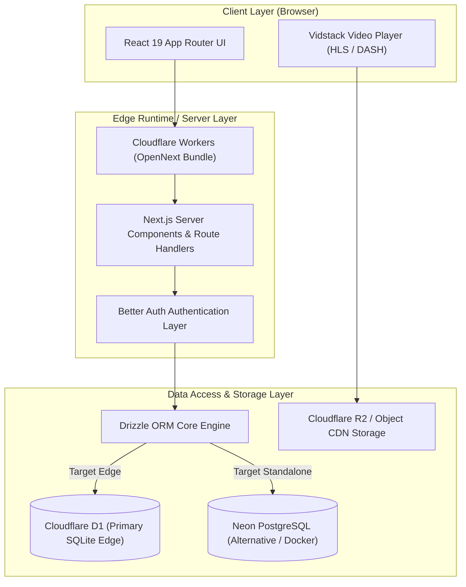

<div align="center">

# GoxStream

**Platform Streaming Anime Open-Source Modern Berbasis Edge Runtime & Hybrid Cloud Infrastructure**

[](https://nextjs.org/)
[](https://react.dev/)
[](https://www.typescriptlang.org/)
[](https://workers.cloudflare.com/)
[](https://tailwindcss.com/)
[](https://orm.drizzle.team/)
[](LICENSE)

</div>

---

> [!NOTE]
> **GoxStream** dirancang khusus untuk memberikan pengalaman streaming video berperforma ultra-rendah latensi dengan memanfaatkan arsitektur Server Components (RSC), pemrosesan video modern berbasis WebAssembly, serta abstraksi runtime independen yang mendukung eksekusi di Cloudflare Workers maupun kontainer Docker/Node.js.

---

## Daftar Isi

- [Arsitektur Sistem](#arsitektur-sistem)
- [Fitur Utama](#fitur-utama)
- [Matriks Teknologi & Komparasi Runtime](#matriks-teknologi--komparasi-runtime)
- [Persyaratan Sistem](#persyaratan-sistem)
- [Panduan Instalasi & Pengembangan Lokal](#panduan-instalasi--pengembangan-lokal)
- [Pengelolaan Database & Migrasi](#pengelolaan-database--migrasi)
- [Panduan Deployment](#panduan-deployment)
  - [Deployment ke Cloudflare Workers](#deployment-ke-cloudflare-workers)
  - [Deployment Kontainer dengan Docker](#deployment-kontainer-dengan-docker)
- [Skrip CLI & Alat Pembantu](#skrip-cli--alat-pembantu)
- [Pengujian (Testing)](#pengujian-testing)
- [Referensi Variabel Lingkungan](#referensi-variabel-lingkungan)
- [Lisensi & Kontribusi](#lisensi--kontribusi)

---

## Arsitektur Sistem

GoxStream mengadopsi prinsip **Cloudflare-First, Not Cloudflare-Locked**. Kode infrastruktur diisolasi penuh melalui abstraksi layer data-access sehingga aplikasi dapat berjalan di Cloudflare Workers Edge Network (menggunakan D1 Database dan KV Cache) atau di lingkungan Node.js/VPS tradisional (menggunakan PostgreSQL dan Redis).



> [!TIP]
> **Aliran Autentikasi Pengguna**: Proses autentikasi dikelola oleh `better-auth` dengan adapter Drizzle ORM yang mengisolasi enkripsi sesi dan token secara aman baik pada database SQLite lokal, Cloudflare D1, maupun PostgreSQL.

---

## Fitur Utama

- **Ultra-Fast Rendering**: Rendering gabungan Server Components (RSC) dan Client Components (CSR) yang dioptimalkan untuk latency minimum.
- **Player Video Modern**: Integrasi Vidstack Player dengan dukungan adaptive bitrate streaming, subtitle dinamis, serta kontrol keyboard intuitif.
- **Portabilitas Runtime**: Dapat di-deploy secara instan ke Cloudflare Workers via `@opennextjs/cloudflare` atau dijalankan di mana saja dengan Docker Multi-Stage Build.
- **Dual Database Engine Support**: Fleksibilitas peralihan skema database antara Cloudflare D1 (SQLite Edge) dan PostgreSQL (Neon/Self-hosted).
- **Desain UI Restrained & Nova Theme**: Estetika modern menggunakan Tailwind CSS v4, Base UI primitives (`@base-ui/react`), dan komponen shadcn v4 tanpa ketergantungan shadows berlebihan.
- **CLI Utility Management**: CLI internal untuk pengelolaan akun administrator, seeding database, serta pengolahan aset gambar dan media.

---

## Matriks Teknologi & Komparasi Runtime

Berikut adalah perbandingan dukungan fitur pada dua target runtime utama GoxStream:

| Fitur / Komponen | Cloudflare Workers Runtime | Docker / Standalone Node.js |
| :--- | :--- | :--- |
| **Framework Layer** | Next.js 16 + `@opennextjs/cloudflare` | Next.js 16 (Node.js 24 LTS) |
| **Primary Database** | Cloudflare D1 (Distributed SQLite) | PostgreSQL (Alpine Container) |
| **Caching Engine** | Cloudflare KV / Workers Cache | Redis (Standalone Container) |
| **Asset Storage** | Cloudflare R2 Bucket | Local Storage / S3 Compatible |
| **Skalabilitas** | Auto-scale global edge network | Horizontal Scaling via Orchestrator |
| **Cold Start** | Latensi < 10ms (Global PoP) | Tergantung spesifikasi VPS/Server |

---

## Persyaratan Sistem

Sebelum memulai instalasi, pastikan lingkungan pengembang memenuhi kriteria berikut:

- **Node.js**: `^20.0.0` atau `^24.0.0` (Direkomendasikan Node.js 24 LTS)
- **Package Manager**: `pnpm` (Corepack diaktifkan)
- **Wrangler CLI**: `v4.x` (Untuk pengembangan Cloudflare Workers)
- **Docker Engine & Docker Compose**: (Opsional, untuk penguji lingkungan kontainer)

---

## Panduan Instalasi & Pengembangan Lokal

### 1. Kloning Repositori & Instalasi Dependensi

```bash
git clone https://github.com/user/goxstream.git
cd goxstream
pnpm install
```

### 2. Konfigurasi Variabel Lingkungan

Salin berkas templat lingkungan yang tersedia:

```bash
cp .env.example .env
```

> [!WARNING]
> Pastikan nilai `BETTER_AUTH_SECRET` diubah dengan kunci acak yang aman sebelum menjalankan aplikasi dalam mode produksi.

### 3. Memulai Server Pengembang

Jalankan server Next.js lokal:

```bash
pnpm dev
```

Buka peramban di `http://localhost:3000` untuk melihat aplikasi berjalan.

---

## Pengelolaan Database & Migrasi

GoxStream menggunakan Drizzle ORM dengan dua skenario driver database. Pengelolaan tabel dan data awal dapat dilakukan melalui skrip pnpm berikut:

### Skenario A: Cloudflare D1 (SQLite Edge)

> [!NOTE]
> Penggunaan D1 adalah skenario utama untuk deployment produksi di Cloudflare Workers.

```bash
# Menjerap skema Drizzle untuk target D1
pnpm db:generate:d1

# Menerapkan migrasi ke database D1 lokal (Wrangler Miniflare)
pnpm db:push:d1:local

# Menerapkan migrasi ke database D1 remote di Cloudflare
pnpm db:push:d1:remote

# Melakukan seeding data awal ke D1 lokal
pnpm db:seed:d1
```

### Skenario B: PostgreSQL (Development / Docker)

```bash
# Menjerap skema Drizzle untuk target PostgreSQL
pnpm db:generate:pg

# Menerapkan skema langsung ke database PostgreSQL
pnpm db:push:pg

# Melakukan seeding data awal ke PostgreSQL
pnpm db:seed:pg
```

---

## Panduan Deployment

### Deployment ke Cloudflare Workers

Deployment ke Cloudflare Workers memanfaatkan OpenNext untuk mentransformasi output Next.js App Router ke format kode kompatibel Cloudflare Workers.

#### 1. Uji Coba Preview Lokal (Miniflare Runtime)

```bash
pnpm preview
```

#### 2. Publikasi Langsung ke Cloudflare Workers

```bash
pnpm deploy
```

> [!IMPORTANT]
> Pastikan Anda telah melakukan autentikasi Wrangler dengan perintah `npx wrangler login` dan nama binding `d1` serta `kv` pada berkas `wrangler.jsonc` telah disesuaikan dengan infrastruktur Cloudflare Anda.

---

### Deployment Kontainer dengan Docker

Untuk lingkungan deployment VPS, Kubernetes, atau server independen, GoxStream menyediakan `Dockerfile` berbasis Node.js 24 Slim dengan Multi-Stage Build serta `docker-compose.yml` lengkap dengan PostgreSQL dan Redis internal.

#### 1. Menjalankan Seluruh Stack dengan Docker Compose

```bash
docker compose up -d --build
```

#### 2. Memeriksa Status Kontainer

```bash
docker compose ps
```

#### 3. Menghentikan Layanan

```bash
docker compose down
```

> [!NOTE]
> Dalam konfigurasi `docker-compose.yml`, layanan database PostgreSQL (`goxstream-postgres`) dan Redis (`goxstream-redis`) berjalan pada jaringan internal terisolasi dan tidak mengekspos port ke luar demi keamanan.

---

## Skrip CLI & Alat Pembantu

GoxStream menyediakan serangkaian skrip CLI interaktif untuk mempermudah pemeliharaan sistem.

<details>
<summary><b>Klik untuk melihat daftar skrip CLI internal</b></summary>

<br />

| Perintah Skrip | Deskripsi Fungsi |
| :--- | :--- |
| `pnpm user-admin` | CLI interaktif untuk manajemen akun penggunan & peran admin |
| `pnpm user-admin:d1` | Manajemen admin khusus database Cloudflare D1 lokal |
| `pnpm user-admin:d1-remote` | Manajemen admin langsung pada Cloudflare D1 produksi |
| `pnpm user-admin:pg` | Manajemen admin pada database PostgreSQL |
| `pnpm setup:ffmpeg` | Pengaturan otomatis binary FFmpeg untuk kebutuhan pengolahan video |
| `pnpm generate:logo` | Generator otomatis aset logo dan favicon proyek |
| `pnpm cf-typegen` | Regenerasi definisi tipe TypeScript dari binding `wrangler.jsonc` |

</details>

---

## Pengujian (Testing)

GoxStream dilengkapi dengan pengujian unit serta pengujian E2E (End-to-End) menggunakan Vitest dan Playwright.

### Unit Testing (Vitest)

```bash
# Menjalankan seluruh pengujian unit
pnpm test:unit

# Menjalankan pengujian unit dalam mode watch
pnpm test:unit:watch
```

### End-to-End Testing (Playwright)

```bash
# Menjalankan pengujian E2E headless
pnpm test:e2e

# Menjalankan pengujian E2E dengan antarmuka UI
pnpm test:e2e:ui

# Membuka laporan hasil pengujian E2E
pnpm test:e2e:report
```

---

## Referensi Variabel Lingkungan

Tabel berikut menjelaskan variabel lingkungan yang dibutuhkan oleh GoxStream:

| Nama Variabel | Status | Nilai Default | Deskripsi |
| :--- | :--- | :--- | :--- |
| `NODE_ENV` | Wajib | `development` | Lingkungan eksekusi (`development` / `production`) |
| `BETTER_AUTH_SECRET` | Wajib | - | Kunci rahasia enkripsi token autentikasi |
| `BETTER_AUTH_URL` | Wajib | `http://localhost:3000` | Base URL domain publik aplikasi |
| `DB_CONNECTION` | Opsional | `d1` | Pilihan driver database (`d1` / `postgres`) |
| `DB_URL` | Kondisional | - | String koneksi PostgreSQL (apabila `DB_CONNECTION=postgres`) |
| `NEXT_PUBLIC_APP_URL` | Wajib | `http://localhost:3000` | URL publik untuk konsumsi sisi klien |

---

## Lisensi & Kontribusi

### Kontribusi

Kontribusi pada proyek GoxStream sangat diapresiasi. Pastikan Anda mengikuti pedoman berikut sebelum mengajukan Pull Request:

1. Kode ditulis menggunakan bahasa Inggris (identifier, komentar, serta nama variabel).
2. Mematuhi standar TypeScript Strict Mode.
3. Seluruh komponen UI baru harus diletakkan dekat dengan fitur terikat (colocation) atau pada `src/components/` jika bersifat global.
4. Menjalankan pengujian unit dan E2E untuk memastikan tidak ada pemutusan fitur eksis.

### Lisensi

Proyek ini dilisensikan di bawah [Lisensi MIT](LICENSE).
