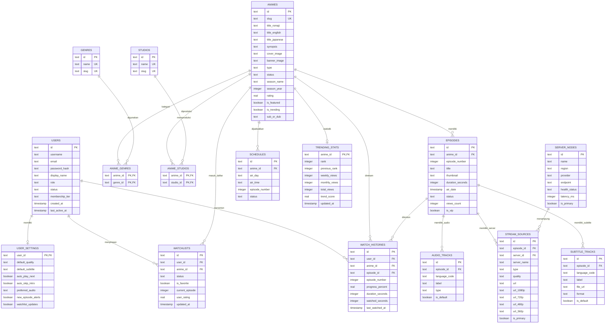

# Perancangan Skema Database GoxStream (D1 / SQLite / PostgreSQL Compatible)

Dokumen ini berisi rancangan relasi database (**Entity Relationship Diagram**) dan struktur entitas mendalam yang diturunkan langsung dari seluruh *mock data* dan komponen UI yang telah dibuat pada platform streaming anime **GoxStream**.

---

## 1. Diagram Relasi Database (ERD)

---

## 2. Daftar Entitas & Struktur Tabel Database

Berikut rincian mendalam setiap entitas database yang dirancang untuk mendukung seluruh komponen UI & data mock platform **GoxStream**.

### 1. Entitas Pengguna & Akses (`users`)
Menyimpan data identitas, peran (*role*), status akun, serta tingkat keanggotaan (Free / VIP Pro).

| Nama Kolom | Tipe Data | Kunci | Keterangan / Constraint |
|---|---|---|---|
| `id` | `TEXT` (UUID/cuid) | PK | Identifier unik pengguna |
| `username` | `TEXT` | UNIQUE | Username unik pengguna |
| `email` | `TEXT` | UNIQUE | Email autentikasi |
| `password_hash` | `TEXT` | - | Hash kata sandi terenkripsi |
| `display_name` | `TEXT` | - | Nama tampilan di UI |
| `avatar_url` | `TEXT` | - | Foto profil pengguna |
| `banner_url` | `TEXT` | - | Gambar sampul profil |
| `bio` | `TEXT` | - | Deskripsi bio pengguna |
| `role` | `TEXT` | Enum | `super_admin`, `admin`, `content_manager`, `moderator`, `user` |
| `status` | `TEXT` | Enum | `active`, `suspended`, `pending` |
| `membership_tier` | `TEXT` | Enum | `free`, `vip_pro` |
| `created_at` | `TIMESTAMP` | - | Waktu pendaftaran akun |
| `updated_at` | `TIMESTAMP` | - | Waktu pembaruan profil |
| `last_active_at` | `TIMESTAMP` | - | Waktu aktivitas terakhir |

---

### 2. Pengaturan Pengguna (`user_settings`)
Menyimpan preferensi pemutar video, bahasa subtitle, dan preferensi notifikasi per pengguna.

| Nama Kolom | Tipe Data | Kunci | Keterangan / Constraint |
|---|---|---|---|
| `user_id` | `TEXT` | PK, FK | Foreign Key ke `users.id` (Relasi 1-to-1) |
| `default_quality` | `TEXT` | Enum | `auto`, `1080p`, `720p`, `480p`, `360p` |
| `default_subtitle` | `TEXT` | - | Kode bahasa bawaan (contoh: `id`, `en`, `jp`) |
| `auto_play_next` | `BOOLEAN` | - | Otomatis putar episode berikutnya (`true`/`false`) |
| `auto_skip_intro` | `BOOLEAN` | - | Otomatis lewati intro/outro (`true`/`false`) |
| `preferred_audio` | `TEXT` | Enum | `subbed`, `dubbed` |
| `new_episode_alerts` | `BOOLEAN` | - | Notifikasi episode baru |
| `watchlist_updates` | `BOOLEAN` | - | Notifikasi pembaruan watchlist |
| `marketing_emails` | `BOOLEAN` | - | Berlangganan email promosi |
| `public_watchlist` | `BOOLEAN` | - | Profil/Watchlist dapat dilihat publik |

---

### 3. Katalog Anime (`animes`)
Entitas utama untuk menyimpan metadatakatalog seri anime.

| Nama Kolom | Tipe Data | Kunci | Keterangan / Constraint |
|---|---|---|---|
| `id` | `TEXT` | PK | Identifier unik anime |
| `slug` | `TEXT` | UNIQUE | URL-friendly slug (contoh: `solo-leveling`) |
| `title_romaji` | `TEXT` | - | Judul utama (Romaji/Jepang) |
| `title_english` | `TEXT` | - | Judul versi bahasa Inggris |
| `title_japanese` | `TEXT` | - | Judul asli huruf Jepang (Kanji/Kana) |
| `synopsis` | `TEXT` | - | Sinopsis lengkap anime |
| `cover_image` | `TEXT` | - | URL poster vertikal |
| `banner_image` | `TEXT` | - | URL gambar banner lanskap/hero |
| `type` | `TEXT` | Enum | `TV`, `Movie`, `OVA`, `Special`, `ONA` |
| `status` | `TEXT` | Enum | `Airing`, `Finished`, `Upcoming`, `Draft` |
| `season_name` | `TEXT` | Enum | `Winter`, `Spring`, `Summer`, `Fall` |
| `season_year` | `INTEGER` | - | Tahun rilis musim (contoh: `2024`) |
| `episodes_count` | `INTEGER` | - | Jumlah total episode |
| `duration_per_ep` | `TEXT` | - | Durasi rata-rata per episode (contoh: `24 min`) |
| `rating` | `REAL` | - | Skor/Rating anime (skala 0.0 - 10.0) |
| `is_featured` | `BOOLEAN` | - | Ditampilkan di Hero Carousel utama |
| `is_trending` | `BOOLEAN` | - | Masuk jajaran anime trending |
| `sub_or_dub` | `TEXT` | Enum | `SUB`, `DUB`, `SUB & DUB` |
| `created_at` | `TIMESTAMP` | - | Tanggal ditambahkan ke database |
| `updated_at` | `TIMESTAMP` | - | Tanggal pembaruan terakhir |

---

### 4. Genre & Relasi (`genres` & `anime_genres`)
Kategori anime dengan relasi *Many-to-Many* antara anime dan genre.

#### Tabel `genres`
| Nama Kolom | Tipe Data | Kunci | Keterangan |
|---|---|---|---|
| `id` | `TEXT` | PK | ID genre (contoh: `g-action`) |
| `name` | `TEXT` | UNIQUE | Nama genre (contoh: `Action`, `Fantasy`) |
| `slug` | `TEXT` | UNIQUE | Slug URL genre |

#### Tabel Pivot `anime_genres`
| Nama Kolom | Tipe Data | Kunci | Keterangan |
|---|---|---|---|
| `anime_id` | `TEXT` | PK, FK | FK ke `animes.id` |
| `genre_id` | `TEXT` | PK, FK | FK ke `genres.id` |

---

### 5. Studio Produksi & Relasi (`studios` & `anime_studios`)
Studio animasi pembuat anime dengan relasi *Many-to-Many*.

#### Tabel `studios`
| Nama Kolom | Tipe Data | Kunci | Keterangan |
|---|---|---|---|
| `id` | `TEXT` | PK | ID studio (contoh: `st-mappa`) |
| `name` | `TEXT` | UNIQUE | Nama studio (contoh: `MAPPA`, `ufotable`) |
| `slug` | `TEXT` | UNIQUE | Slug URL studio |

#### Tabel Pivot `anime_studios`
| Nama Kolom | Tipe Data | Kunci | Keterangan |
|---|---|---|---|
| `anime_id` | `TEXT` | PK, FK | FK ke `animes.id` |
| `studio_id` | `TEXT` | PK, FK | FK ke `studios.id` |

---

### 6. Episode Anime (`episodes`)
Detail setiap episode dari suatu judul anime.

| Nama Kolom | Tipe Data | Kunci | Keterangan |
|---|---|---|---|
| `id` | `TEXT` | PK | ID episode |
| `anime_id` | `TEXT` | FK | FK ke `animes.id` |
| `episode_number` | `INTEGER` | - | Nomor urut episode |
| `title` | `TEXT` | - | Judul episode |
| `thumbnail` | `TEXT` | - | Gambar cuplikan episode |
| `duration_seconds` | `INTEGER` | - | Durasi total episode (dalam detik) |
| `air_date` | `TIMESTAMP` | - | Tanggal tayang episode |
| `status` | `TEXT` | Enum | `published`, `draft`, `scheduled`, `processing` |
| `views_count` | `INTEGER` | - | Total tayangan episode |
| `is_vip` | `BOOLEAN` | - | Khusus pengguna VIP Pro |
| `created_at` | `TIMESTAMP` | - | Tanggal pembuatan record |

---

### 7. Node CDN & Server Streaming (`server_nodes` & `episode_stream_sources`)
Manajemen infrastruktur server video dan link stream per episode.

#### Tabel `server_nodes`
| Nama Kolom | Tipe Data | Kunci | Keterangan |
|---|---|---|---|
| `id` | `TEXT` | PK | ID Node Server (contoh: `srv-cf-r2-01`) |
| `name` | `TEXT` | - | Nama Server (contoh: `Cloudflare R2 Primary`) |
| `region` | `TEXT` | - | Lokasi Wilayah (contoh: `ap-southeast-1`) |
| `provider` | `TEXT` | - | Provider CDN / Storage |
| `endpoint` | `TEXT` | - | Base URL Endpoint |
| `health_status` | `TEXT` | Enum | `online`, `degraded`, `offline` |
| `latency_ms` | `INTEGER` | - | Latensi server dalam milidetik |
| `is_primary` | `BOOLEAN` | - | Server utama sistem |

#### Tabel `episode_stream_sources`
| Nama Kolom | Tipe Data | Kunci | Keterangan |
|---|---|---|---|
| `id` | `TEXT` | PK | ID sumber stream |
| `episode_id` | `TEXT` | FK | FK ke `episodes.id` |
| `server_id` | `TEXT` | FK | FK ke `server_nodes.id` |
| `server_name` | `TEXT` | - | Label nama server pemutar |
| `type` | `TEXT` | Enum | `hls`, `mp4`, `embed`, `dash` |
| `quality` | `TEXT` | Enum | `1080p`, `720p`, `480p`, `360p`, `auto` |
| `url` | `TEXT` | - | URL stream utama / playlist m3u8 |
| `url_1080p` | `TEXT` | - | URL khusus 1080p (opsional) |
| `url_720p` | `TEXT` | - | URL khusus 720p (opsional) |
| `url_480p` | `TEXT` | - | URL khusus 480p (opsional) |
| `url_360p` | `TEXT` | - | URL khusus 360p (opsional) |
| `is_primary` | `BOOLEAN` | - | Sumber video utama untuk diputar |

---

### 8. Teks Terjemahan & Audio (`subtitle_tracks` & `audio_tracks`)
Manajemen multi-language subtitles (VTT/SRT/ASS) dan audio (Sub/Dub).

#### Tabel `subtitle_tracks`
| Nama Kolom | Tipe Data | Kunci | Keterangan |
|---|---|---|---|
| `id` | `TEXT` | PK | ID trek subtitle |
| `episode_id` | `TEXT` | FK | FK ke `episodes.id` |
| `language_code` | `TEXT` | - | ISO-639 kode bahasa (contoh: `id`, `en`, `ja`) |
| `label` | `TEXT` | - | Label bahasa (contoh: `Indonesian Sub`) |
| `file_url` | `TEXT` | - | Path/URL file subtitle VTT/SRT |
| `format` | `TEXT` | Enum | `vtt`, `srt`, `ass` |
| `is_default` | `BOOLEAN` | - | Subtitle bawaan saat pemutaran awal |

#### Tabel `audio_tracks`
| Nama Kolom | Tipe Data | Kunci | Keterangan |
|---|---|---|---|
| `id` | `TEXT` | PK | ID trek audio |
| `episode_id` | `TEXT` | FK | FK ke `episodes.id` |
| `language_code` | `TEXT` | - | ISO-639 kode bahasa |
| `label` | `TEXT` | - | Label trek (contoh: `Japanese Original`, `English Dub`) |
| `type` | `TEXT` | Enum | `original`, `dub`, `commentary` |
| `is_default` | `BOOLEAN` | - | Audio bawaan |

---

### 9. Jadwal Rilis Airing (`schedules`)
Menyimpan jadwal tayang mingguan anime yang sedang *airing*.

| Nama Kolom | Tipe Data | Kunci | Keterangan |
|---|---|---|---|
| `id` | `TEXT` | PK | ID Jadwal |
| `anime_id` | `TEXT` | FK | FK ke `animes.id` |
| `air_day` | `TEXT` | Enum | `monday`, `tuesday`, `wednesday`, `thursday`, `friday`, `saturday`, `sunday` |
| `air_time` | `TEXT` | - | Jam rilis format WIB (contoh: `22:00`) |
| `episode_number` | `INTEGER` | - | Nomor episode yang dijadwalkan tayang |
| `status` | `TEXT` | Enum | `airing_now`, `upcoming`, `aired` |

---

### 10. Daftar Tonton Pengguna (`watchlists`)
Koleksi anime yang disimpan oleh pengguna.

| Nama Kolom | Tipe Data | Kunci | Keterangan |
|---|---|---|---|
| `id` | `TEXT` | PK | ID Watchlist Item |
| `user_id` | `TEXT` | FK | FK ke `users.id` |
| `anime_id` | `TEXT` | FK | FK ke `animes.id` |
| `status` | `TEXT` | Enum | `watching`, `plan_to_watch`, `completed`, `on_hold`, `dropped` |
| `is_favorite` | `BOOLEAN` | - | Ditandai sebagai favorit |
| `current_episode` | `INTEGER` | - | Episode terakhir yang ditonton |
| `user_rating` | `REAL` | - | Rating personal dari pengguna |
| `updated_at` | `TIMESTAMP` | - | Waktu pembaruan status tonton |

---

### 11. Riwayat Menonton (`watch_histories`)
Perekaman posisi durasi pemutaran video pengguna untuk fitur *Continue Watching*.

| Nama Kolom | Tipe Data | Kunci | Keterangan |
|---|---|---|---|
| `id` | `TEXT` | PK | ID Rekaman Riwayat |
| `user_id` | `TEXT` | FK | FK ke `users.id` |
| `anime_id` | `TEXT` | FK | FK ke `animes.id` |
| `episode_id` | `TEXT` | FK | FK ke `episodes.id` |
| `episode_number` | `INTEGER` | - | Nomor episode |
| `progress_percent` | `REAL` | - | Persentase progres menonton (0.0 - 100.0%) |
| `duration_seconds` | `INTEGER` | - | Total durasi episode |
| `watched_seconds` | `INTEGER` | - | Detik posisi pemutaran terakhir |
| `last_watched_at` | `TIMESTAMP` | - | Timestamp waktu tonton |

---

### 12. Statistik Trending & Analytics (`trending_stats`)
Data metrik analitik tayangan mingguan, bulanan, dan perankingan anime.

| Nama Kolom | Tipe Data | Kunci | Keterangan |
|---|---|---|---|
| `anime_id` | `TEXT` | PK, FK | FK ke `animes.id` |
| `rank` | `INTEGER` | - | Peringkat trending saat ini |
| `previous_rank` | `INTEGER` | - | Peringkat periode sebelumnya |
| `weekly_views` | `INTEGER` | - | Jumlah tayangan 7 hari terakhir |
| `monthly_views` | `INTEGER` | - | Jumlah tayangan 30 hari terakhir |
| `total_views` | `INTEGER` | - | Akumulasi total tayangan sepanjang masa |
| `trend_score` | `REAL` | - | Skor algoritma kalkulasi tren |
| `updated_at` | `TIMESTAMP` | - | Waktu rekapitulasi data tren |

---

## 3. Catatan Integrasi dengan Drizzle ORM & Cloudflare D1

1. **Kesesuaian Tipe Data D1 (SQLite)**:
   - Primary Key menggunakan string UUID/cuid (`text("id").primaryKey()`).
   - Nilai tanggal/waktu disimpan sebagai ISO-8601 string atau Unix Timestamp (`integer("created_at", { mode: "timestamp" })`).
   - Enum disimpan sebagai `text` dengan pengecekan di tingkat TypeScript (Zod/Drizzle runtime check).
2. **Kinerja Indeks (Indexing)**:
   - Indeks disarankan pada `animes(slug)`, `episodes(anime_id, episode_number)`, `watch_histories(user_id, last_watched_at)`, `watchlists(user_id, status)`, dan `schedules(air_day)`.
